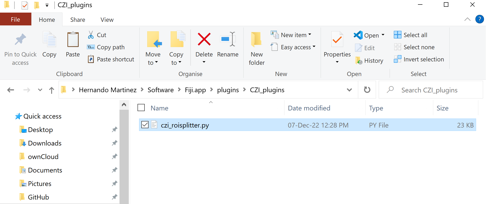
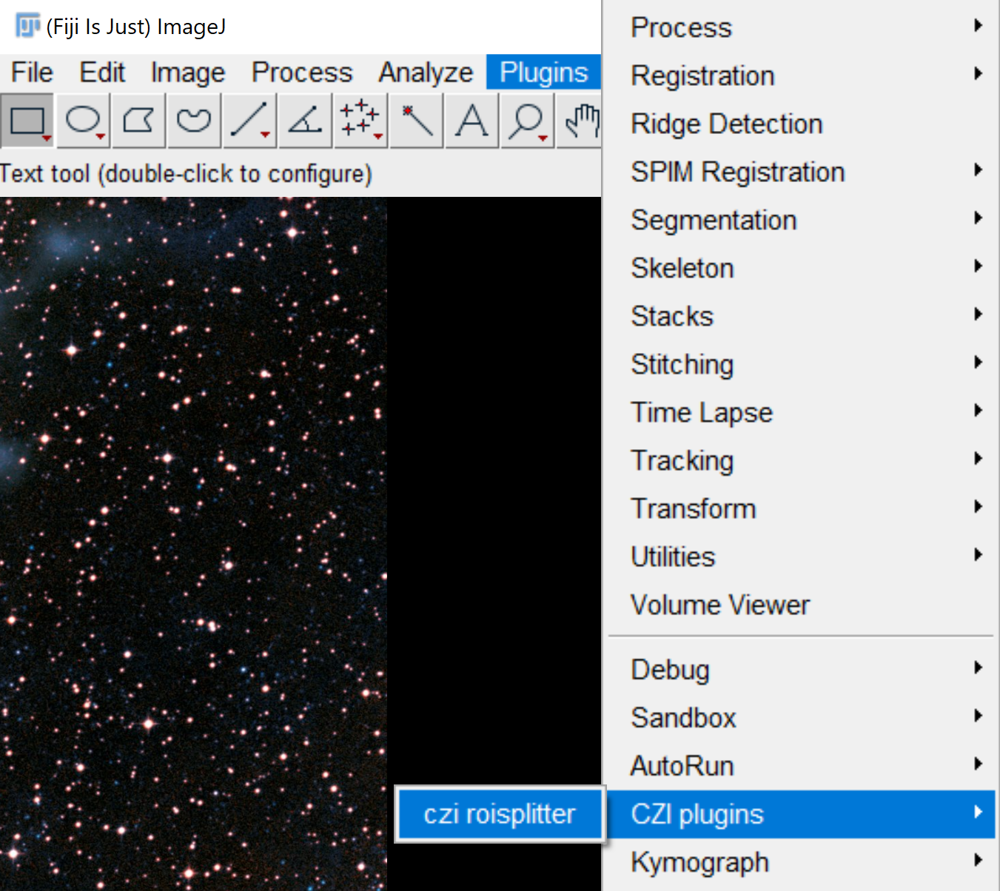

# czi-roisplitter

This script generates a Fiji GUI used to browse through .czi files coming from the Slide Scanner, 
displaying low resolution versions of the images, 
and allowing the user to select big ROIs, 
or to load ROIs from the Allen Brain Atlas assuming previous registration of the images with ABBA.
It then splits the big ROIs into smaller images and saves them independently splitting each channel,
at the resolution desired.

It depends on functions that are located in the following repo, so make sure you have them in your Fiji:

https://github.com/HernandoMV/czi-rs-functions

Either drag czi_roisplitter.py to Fiji and run it, or add it inside "Fiji.app/plugins" to have it
as a plugin in your Fiji. You can add scripts like this one inside subfolders in "plugins" to have
your Fiji->Plugins menu better organised:

  
  

It is used in larger pipelines like this one TODO: insert here link to PH3 analysis repo 

TODO: insert here picture of the GUI